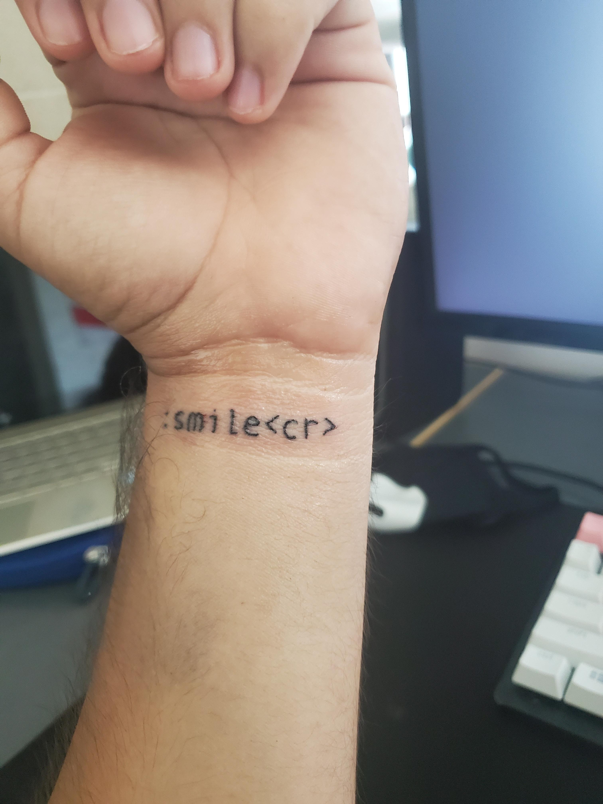

# Table-of-Contents

- Quick Story:
- I have a vim tattoo (very important)
- Who am I?
- [What](What) Vim means to me
- Essays
- Diary taking
- Math notes
- Data-wrangling


---

# Quick Story

One of my favorite vim links to share is: https://rudism.com/vim-creep/


It carries a lot of sentiment about why Vim is so loved and disliked.


The way I got started using Vim was in High School due to an upperclassmen saying I would never be able to use it...


Now, I realize that in a way he was right, but also wrong...


---

# I have a vim tattoo (very important)



---

# Who am I?

- Charlie (SeniorMars)
- Sophomore in college studying Math and Linguistics
- I have a vim tattoo (again very important)
- Taught the Lazy Art of Programming at Rice University
- Maintainer of some AUR packages
- Contributed to the Rust Programming language (crab time)
- I like to speed up my workflow

| Lecture | Topic                                  |
| ------- | ----                                   |
| 0       | Class Intro, Unix, and Terminal Usage  |
| 1       | Data Wrangling and Unix Tools          |
| 2       | Shell Scripting                        |
| 3       | Terminal Text Editors and Alternatives |


---

# What Vim is for most people

- A code editor
- A weird way to flex
- An environment
- A meme

https://preview.redd.it/rrudjl9s46a91.gif?format=mp4&s=9e632d8223a267691e23a740f09a486df2952e49 


---

# What Vim means to me

[ Rant ]

---
 
> I want to show you what vim can do for non-programmers

---

# Essays

- Vim Internal Spell Checker
- Different Languages
- Vim Digraphs
- Language-tool
- Statusline and diagnostics
- Coc-word

---

# The Vim internals

Vim has a lot of features that are useful outside programming:

- Spell checking (`:help spell`)
- `:set spell`

| Keybinding  | Description                                          |
|-------------|------------------------------------------------------|
| <count>`]s` | Move to the next misspelled word after the cursor   |
| <count>`[s` | Move to the next misspelled word before the cursor  |
| `zg`        | Add the word under the cursor to your spellfile      |
| `zw`        | Add the word under the cursor to a `bad` word        |
| `zug`       | Remove the word under the cursor from your spellfile |
| `zuw`       | Remove the word under the cursor as a `bad` word     |
| <count>`z=` | Suggest a fix for the word under your cursor         |


> The ultimate keybind: `keyset("n", "<leader>z", "[s1z=``")`

---

# Different languages and more keybinds


## Languages I'm learning
- English (`en_us`)
- Spanish (`es`)
- German (`de`)
- Mandarin (`cjk`)
- Korean (`cjk`)

```lua
function spelltoggle()
    if vim.opt.spell:get() then
        vim.opt_local.spell = false
        vim.opt_local.spelllang = "en"
    else
        vim.opt_local.spell = true
        vim.opt_local.spelllang = {"en_us", "de"}
    end
end
```

- `keyset("n", "<leader>5", ":lua SpellToggle()<cr>")`
- `keyset("n", "<leader>sr", ':%s/<<C-r><C-w>>//g<Left><Left>')`


> Note: my statusline tells me which language's spellchecker is active

```lua
local word_count = function()
    if vim.fn.wordcount().visual_words ~= nil then
        return vim.fn.wordcount().visual_words
    else
        return vim.fn.wordcount().words
    end
end
```

---

# Vim Digraphs


> Digraphs are used to enter characters that normally cannot be entered by an ordinary keyboard.  These are mostly printable non-ASCII characters.

See `:digraphs`

- Use `C-k` to enter a digraph
- Greek letters: (`*`) and:

| Word         | Symbol | Maps to                           |
|--------------|--------|-----------------------------------|
| Equals       | =      | Cyrillic (= used as second char)  |
| Asterisk     | *      | Greek                             |
| Percent sign | %      | Greek/Cyrillic special            |
| Plus         | +      | smalls: Arabic, capitals: Hebrew  |
| Three        | 3      | some Latin/Greek/Cyrillic letters |
| Four         | 4      | Bopomofo                          |
| Five         | 5      | Hiragana                          |
| Six          | 6      | Katakana                          |

Also see `:help digraph-table`

---

# Plugins


## Coc-word

- Can be use with dictionary (`:help dictionary`), but I prefer this method
- Top 1000 words are automatically added to my ins-completion
- Highly recommended if you can't spell.


## Language tool
> Imagine grammarly, but worse, kinda open source, and with multiple language support

- rhysd/vim-grammarous
- uses the quickfix list
- easy to use

---

# Vimwiki
- Todos
- Support for HTML
- Markdown support
- Math support
- Github pages


```lua
keyset("n", "<backspace>", "<C-^")
keyset("n", "<Leader>ww", ":VimwikiIndex<cr>")
keyset("n", "<Leader>wd", ":VimwikiMakeDiaryNote<cr>")
keyset('n', '<Leader>ll', '<Plug>VimwikiFollowLink')
keyset('n', '<Leader>ln', '<Plug>VimwikiNextLink')
keyset('n', '<Leader>lp', '<Plug>VimwikiPrevLink')
vim.g.vimwiki_list = {{path = '~/Work/vimwiki'}}
```

Features:
- Wiki (links)
- search through all wiki pages
- Tables
- outline notes and tasks in indented lists
- Diary / Daily Todos

---

# Math notes
- Vimtex
- Zathura
- Github copilot
- Vim-snippets
- Wolfscript


---
# Vimtex + Zathura
- Conceal
- Autocompile
- Zathura dark mode
- Let's you write math extremely fast


---
# Github copilot and vim-snippets
- Take the tedious parts out and lets you write your math
- Automate the latex you don't need to remember
- Use the incorrectness to help you finish faster 
- Wolfscript

---
# Other important mentions
- `:!`
- Unix tools
- shell keybinds
- `Personal Development Environment`
- Look into `:help`


---


# Conclusion
- If you write text, then vim is a powerful tool
- Once your keybinds are in place, it’s a perfect for many tasks
- Along with data wrangling and the obvious power of using vim for coding
- Vim is perfect for more than just coding, and perhaps many should consider using the tool
- However, you should decide on how you want to use your time
- Over customization may not help you in the long run
- Workflow videos like this help show people the power of vim!
